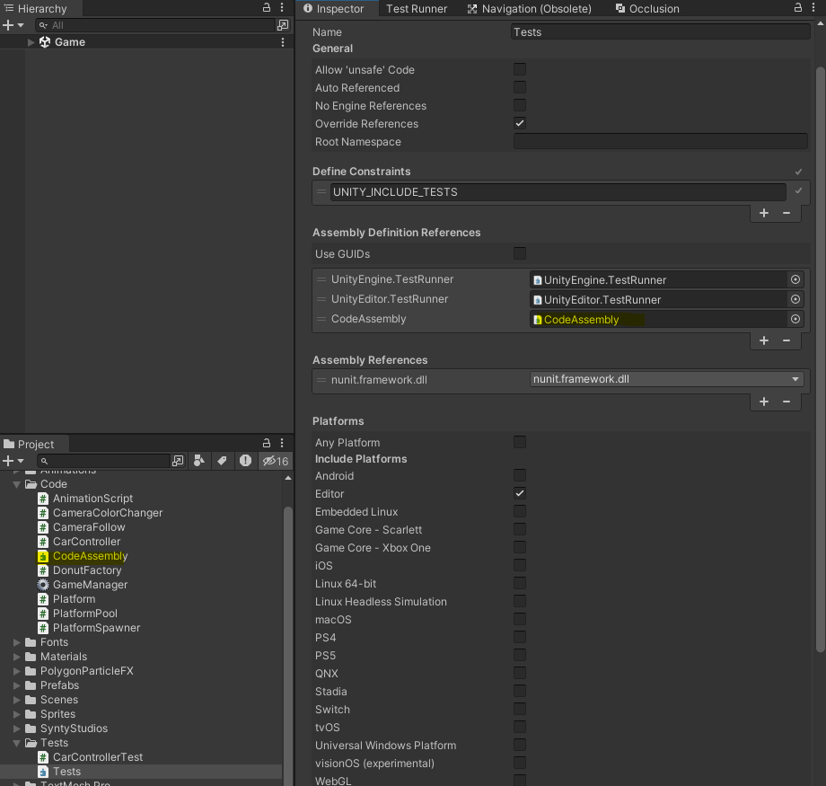

# Readme - Patrones de Diseño Endless Runner

Este README proporciona una descripción general de tres patrones de diseño utilizados en este proyecto de juego implementado en Unity. Los patrones de diseño discutidos son Singleton, Object Pool y Factory. Además, se describe la jugabilidad del juego, que incluye dos ejecutables, uno para web y otro para Android.

## Patrones de Diseño

### Singleton

El patrón Singleton se utiliza en la clase `GameManager` para garantizar que solo haya una instancia de esta clase en todo el juego. Esto se logra asignando la instancia estática `GameManager.instance` a la primera instancia creada de `GameManager`. Esto permite un acceso global a las funcionalidades del juego y asegura que no se creen múltiples instancias de `GameManager`, lo que podría provocar problemas de consistencia en el juego.

### Object Pool

El patrón Object Pool se implementa en la clase `PlatformPool`. En lugar de crear y destruir plataformas constantemente, se crea un grupo de plataformas en el inicio del juego y se almacenan en una cola. Cuando se necesita una plataforma, se toma una de la cola y se activa en su posición adecuada. Cuando una plataforma ya no es necesaria, se desactiva y se vuelve a colocar en la cola para su reutilización. Esto ahorra recursos de memoria y mejora el rendimiento del juego, ya que se evita la creación y destrucción constante de objetos.

### Factory

El patrón Factory se utiliza en la clase `Platform` para crear objetos donut y adjuntarlos a las plataformas. La clase `DonutFactory` se encarga de crear instancias de donuts. Algunas plataformas tendrán donuts, mientras que otras no. Utilizando una fábrica, se abstrae la creación de donuts, permitiendo que las plataformas decidan si deben tener un donut o no sin exponer los detalles de la creación de donuts en el código de las plataformas.

## Jugabilidad del Juego

El juego es un juego de plataformas en el que el jugador controla un personaje. El objetivo es evitar que el personaje caiga al vacío al saltar de plataforma en plataforma.

- **Control del juego**: El juego se controla haciendo clic izquierdo cambiando la direccion del carro entre izquierda o derecha.

- **Funcionalidad del GameManager**: El `GameManager` maneja el flujo del juego. Cuando el juego comienza, se inicia la música y comienza el contador de puntos. Si el jugador falla, el juego se detiene, se guarda la puntuación más alta y se muestra una pantalla de Game Over.

- **Reanudar y Pausar**: El jugador puede pausar el juego presionando la tecla "Escape". Esto muestra un menú de pausa y detiene el tiempo del juego. El jugador también puede reanudar el juego desde el menú de pausa.

- **Puntuación**: El jugador acumula puntos a medida que permanece en el juego. Si el personaje interactúa con la donut, obtiene puntos adicionales.

- **Objetivo del juego**: El objetivo del juego es mantener al personaje en movimiento para obtener la máxima puntuación posible sin caer al vacío.

- **Web y Android**: El juego está disponible en dos versiones ejecutables: una para web y otra para Android. Esto proporciona flexibilidad a los jugadores para elegir cómo quieren jugar.

## Pruebas Unitarias en Unity
Par configurar el ambiente de pruebas dentro de unity descargamos el paquete Test Framework desde el `Package Manager` en el siguiente paso abrimos la pestana de `Test Runner` desde `Window/General/TestRunner`  una vez abierta la pestana `Test Runner` le damos a la opcion Create `EditMode Test Assembly Folder` esta nos creara la carpeta `Test` dentro del proyecto con su debido Assembly, dentro del `Inspector` y con el archivo `Tests` seleccionado agregamos nuestro `CodeAssembly` que tiene los codigos que testearemos en esta carpeta 

### Ejecutar Pruebas
Para ejecutar tus pruebas unitarias desde el Test Runner:
1. Ve a Window > General > Test Runner en el Editor de Unity.
2. En la ventana del Test Runner, deberías ver tus pruebas listadas.
3. Haz clic en el botón "Run All" para ejecutar todas las pruebas.
4. Observa la salida de la prueba para ver si todas las pruebas pasan o fallan.

### Ejemplo Codigo Usado 
```csharp
using System.Collections;
using System.Collections.Generic;
using NUnit.Framework;
using UnityEngine;
using UnityEngine.TestTools;

public class CarControllerTest
{
    private GameObject carGameObject;
    private CarController carController;

    [SetUp]
    public void SetUp()
    {
        carGameObject = new GameObject("DodgeCharger");
        carController = carGameObject.AddComponent<CarController>();
    }

    [TearDown]
    public void TearDown()
    {
        // Destroy may not be called from edit mode!
        Object.DestroyImmediate(carGameObject);
    }

    // A Test behaves as an ordinary method
    [Test]
    public void CarControllerTest_Move_ShouldChangePosition()
    {
        // guardamos posicion inicial
        Vector3 initialPosition = carGameObject.transform.position;

        // llamamos el metodo Move
        carController.Move();

        // comprobamos que la posicion ha cambiado
        Assert.AreNotEqual(initialPosition, carGameObject.transform.position);
    }

    [Test]
    public void CarControllerTest_ChangeDirection_ShouldChangeRotation()
    {
        // Guardar rotacion incial
        Quaternion initialRotation = carGameObject.transform.rotation;

        // llama el metodo ChangeDIrection
        carController.ChangeDirection();

        // comprobamos que la rotacion haya cambiado
        Assert.AreNotEqual(initialRotation, carGameObject.transform.rotation);
    }
}
```
## Ejecutables

Puedes jugar en dos plataformas diferentes:

1. **Versión Web**: Para jugar en tu navegador web, haz clic en el siguiente enlace:
   [Jugar en el navegador web](https://a-la-fresh.itch.io/zig-zag-runner)

2. **Versión Android**: Si prefieres jugar en tu dispositivo Android, puedes descargar la versión móvil del juego en este enlace de drive:
   [Descargar para movil](https://drive.google.com/file/d/1K2EBxF6H1spZ2benM9YRgF_uvfofWGKt/view?usp=sharing)
